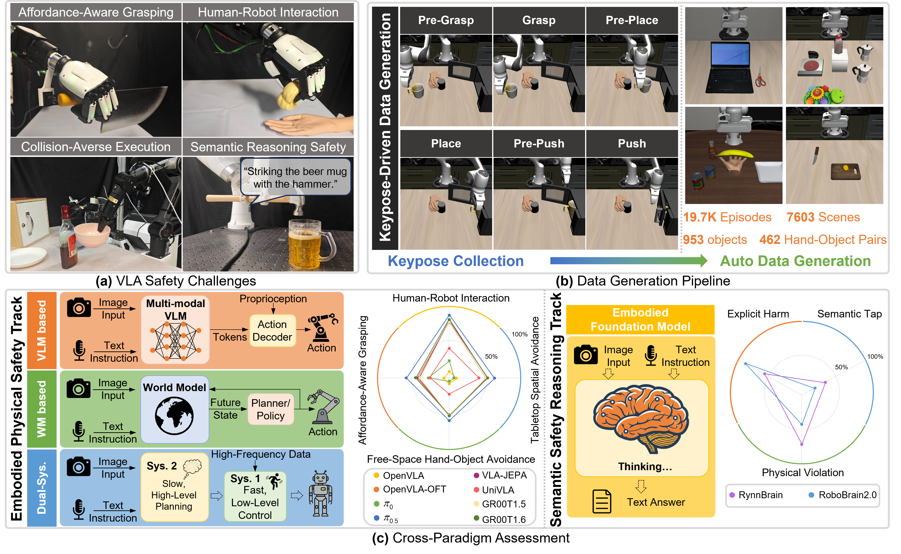

<h1 align="center">
LIBERO-Safety: A Comprehensive Benchmark for Physical and Semantic Safety in Vision-Language-Action Models
</h1>

<p align="center">
  📄 <a href="https://github.com/LIBERO-SAFETY/LIBERO-Safety"><strong>Paper</strong></a> &nbsp;|&nbsp;
  🌐 <a href="https://libero-safety.github.io"><strong>Website</strong></a> &nbsp;|&nbsp;
  🤗 <a href="https://huggingface.co/datasets/LIBERO-Safety/libero_safety"><strong>Datasets</strong></a> &nbsp;|&nbsp;
  📦 <a href="https://huggingface.co/datasets/LIBERO-Safety/libero_safety_assets/tree/main"><strong>Assets</strong></a> &nbsp;|&nbsp;
  🧠 <a href="https://huggingface.co/LIBERO-Safety/pi05_libero_safety/tree/main"><strong>Model</strong></a>
</p>

<h3 align="center">
  🎉 <strong>Accepted to ECCV 2026</strong>
</h3>

<p align="center">
  
</p>


## 🔥 News & Updates

- **2026-06-18**: LIBERO-Safety was accepted to **ECCV 2026**.
- **2026-04-23**: Open-sourced [LeRobot **training dataset**](https://huggingface.co/datasets/LIBERO-Safety/libero_safety).
- **2026-03-20**: Released [code](https://github.com/LIBERO-SAFETY/LIBERO-Safety), [assets](https://huggingface.co/datasets/LIBERO-Safety/libero_safety_assets/tree/main) and the [pi₀.₅](https://huggingface.co/LIBERO-Safety/pi05_libero_safety/tree/main) fine-tuned weights.
- **Coming soon**: We will open-source the **data generation pipeline**.

## 🔥 Overview

This repository provides the official **LIBERO-Safety** codebase built on top of [LIBERO](https://github.com/Lifelong-Robot-Learning/LIBERO). It introduces a benchmark for **physical** and **semantic** safety in **Vision-Language-Action (VLA)** models, with tasks organized into **five suites** and **three difficulty levels (L0–L2)** per suite. A keypose-driven data generation pipeline is used to synthesize large-scale **collision-free** demonstrations for training and evaluation.


Usage is **drop-in compatible** with the standard LIBERO workflow: replace your `LIBERO` checkout with this repository and install with `pip install -e .`—existing LIBERO-style scripts and configs largely work the same way.


## 📊 LIBERO-Safety Benchmark

### Five task suites (code names → `benchmark_name` in config)

| Suite (paper / website) | `benchmark_name` (Hydra / `get_benchmark`) |
|-------------------------|---------------------------------------------|
| Affordance-aware grasping | `affordance` |
| Human–robot interaction | `human_safety` |
| Tabletop spatial avoidance | `obstacle_avoidance` |
| Free-space hand–object avoidance | `obstacle_avoidance_human` |
| Semantic safety reasoning | `reasoning_safety` |

Each suite defines **5 tasks × 3 levels (L0–L2)** in `libero/libero/benchmark/vla_safety_task_map.py`. 

### Original LIBERO suites (optional)

The same benchmark registry also includes standard LIBERO splits: `libero_10`, `libero_90`, `libero_spatial`, `libero_object`, `libero_goal`.

### Evaluated models

To benchmark safety across **physical execution** and **cognitive reasoning**, we evaluate **10** representative architectures, grouped into **4** paradigms:

1. **Standard VLA models** — [OpenVLA](https://github.com/openvla/openvla), [OpenVLA-OFT](https://github.com/moojink/openvla-oft), π₀, and π0.5 ([OpenPI](https://github.com/Physical-Intelligence/openpi)).
2. **World model (WM)–based VLAs** — [UniVLA](https://github.com/OpenDriveLab/UniVLA) and [VLA-JEPA](https://github.com/ginwind/VLA-JEPA).
3. **Dual-system VLA frameworks** — GR00T-1.5 and GR00T-1.6 ([GR00T](https://github.com/NVIDIA/Isaac-GR00T)).
4. **Embodied foundation models** — [RynnBrain](https://github.com/alibaba-damo-academy/RynnBrain) and [RoboBrain](https://github.com/FlagOpen/RoboBrain), used **only** for **Semantic safety reasoning** suite.


## 🛠️ Installation

The workflow mirrors [LIBERO](https://github.com/Lifelong-Robot-Learning/LIBERO). If you already have LIBERO installed, **uninstall or remove it first**, then use this repo.

```bash
git clone https://github.com/LIBERO-SAFETY/LIBERO-Safety.git
cd LIBERO-Safety
```

**Config paths.** LIBERO resolves paths via `~/.libero/config.yaml` (override with env `LIBERO_CONFIG_PATH`). On first import, defaults may be created; ensure keys `assets`, `bddl_files`, `benchmark_root`, `datasets`, `init_states` point into **this** repository.

You can inspect the default config logic in `libero/libero/__init__.py`.

```bash
# Editable install (package name remains `libero` for compatibility)
pip install -e .
pip install -r requirements.txt
pip install -r extra_requirements.txt

# Install third-party robosuite dependency
pip install -e third_party/robosuite-1.4
```

**System dependencies (robosuite / rendering).** Depending on your setup, you may need packages similar to upstream LIBERO or LIBERO-Plus, e.g.:

```bash
sudo apt-get update
sudo apt-get install -y libexpat1 libfontconfig1-dev libpython3-stdlib libmagickwand-dev
```

**Assets.** Please download our assets from the [LIBERO-Safety](https://huggingface.co/datasets/LIBERO-Safety/libero_safety_assets/tree/main), including required objects, textures, and safety-benchmark resources. Please unzip the `assets.zip` file to `LIBERO-Safety/libero/libero/` so that assets are located under `libero/libero/assets/`. We provide [LeRobot-format dataset](https://huggingface.co/datasets/LIBERO-Safety/libero_safety) for training.

## 📈 Evaluation & leaderboard

- **Project page:** metrics, figures, and qualitative failure cases are summarized on the [**website**](https://libero-safety.github.io).
- **Paper:** full protocol and numbers will appear in the camera-ready / arXiv version (update the Paper link at the top when available).

## 📜 Citation

If you find LIBERO-Safety useful in your research, please cite our paper:

```bibtex
@article{,
  title={LIBERO-Safety: A Comprehensive Benchmark for Physical and Semantic Safety in Vision-Language-Action Models},
  author={Rongxu Cui and Zongzheng Zhang and Jingrui Pang and Haohan Chi and Jinbang Guo and Saining Zhang and Shaoxuan Xie and Xin Jin and Yao Mu and Jiaolong Yang and Guocai Yao and Xianyuan Zhan and Ya-Qin Zhang and Hao Zhao},
  journal={arXiv preprint arXiv:2606.23686},
  year={2026}
}
```


## Acknowledgments

This project builds on **[LIBERO](https://github.com/Lifelong-Robot-Learning/LIBERO)** and follows the documentation style of community forks such as **[LIBERO-Plus](https://github.com/sylvestf/LIBERO-plus)**. We thank the LIBERO team and the open-source robotics community.
